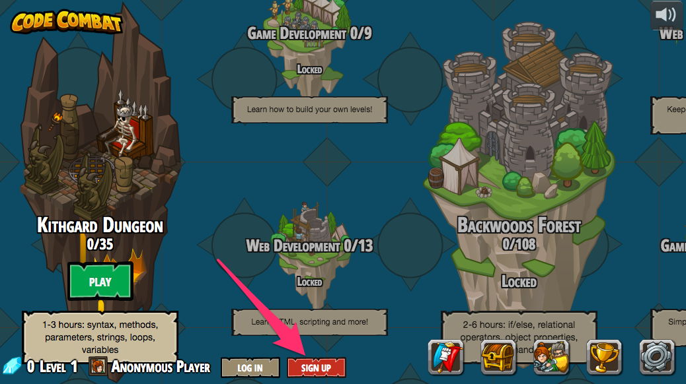
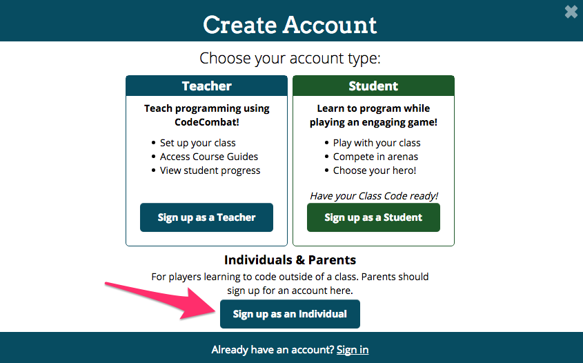
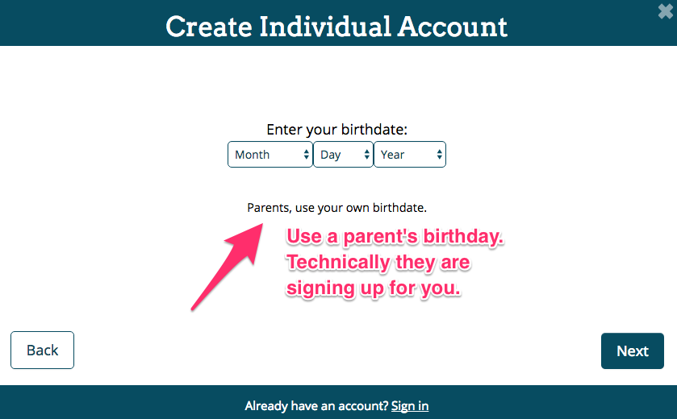
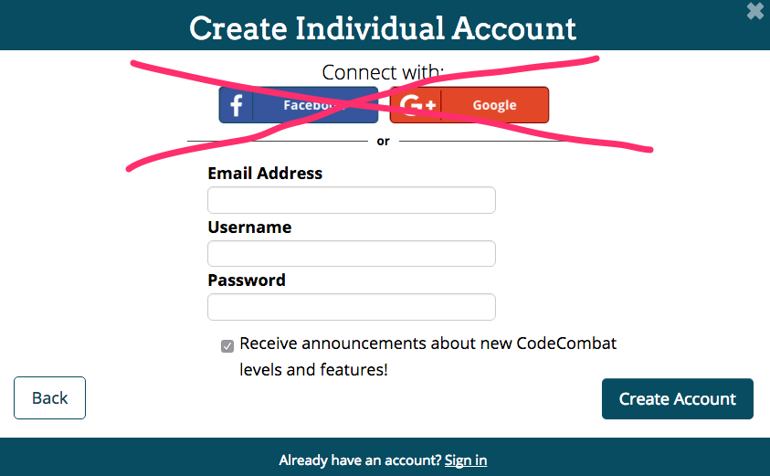
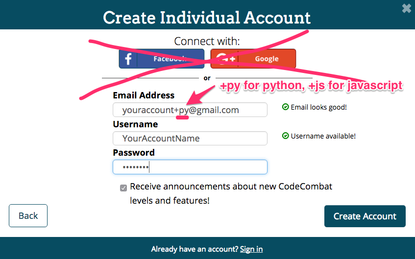
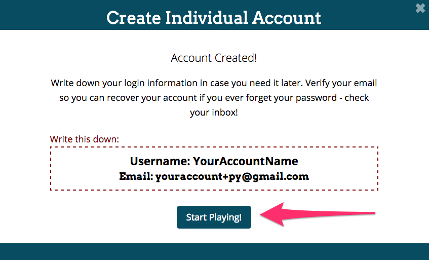
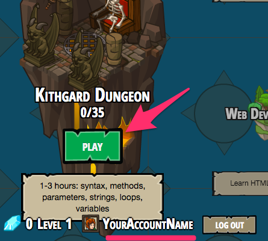
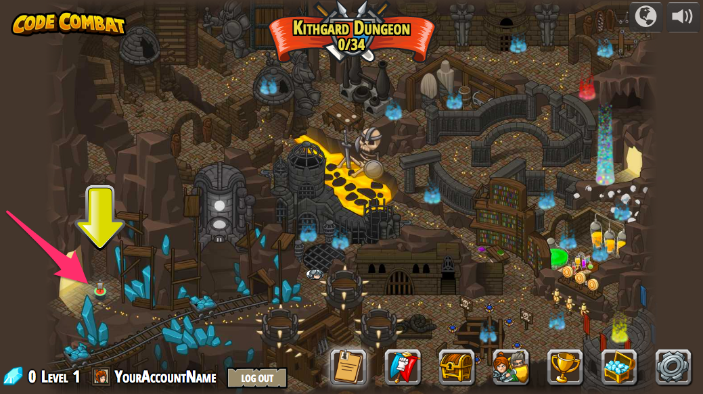

# Create CodeCombat.com Account(s)

Welcome to CodeCombat, the most fun we have found to learn
programming online. Let's create an account, or two.

## Multiple Gmail Accounts

A lot of people don't know that when you create a Gmail account you
are actually creating an infinite number of different email addresses
that you can use for everything and anything, but that all send you
email to the same main account. All of the following will go to the
same `youraccount@gmail.com` account:

* `youraccount@gmail.com`
* `your.account@gmail.com`
* `y.o.u.r.a.c.c.o.u.n.t@gmail.com`
* `youraccount+py@gmail.com`
* `youraccount+js@gmail.com`
* `youraccount+whatever@gmail.com`

This is extremely useful when you need more than one account on
another service, like CodeCombat, Twitter, GitHub or whatever else.

## Create Two Accounts

When you [picked your primary technology path](path.md), you also
picked the main language you will learn in CodeCombat, Python or
JavaScript (Web). You should go ahead and create accounts for both
languages right just both are there when you want them. If you are
dedicated you can actually do them both. 

Avoid the temptation to create a Google+ account because that requires
you to be logged into Google from that browser, which prevents you
from easily switching between the different languages.

Now that you have completed the steps to signup for one account,
say `+py`, do them again for an account for the other language, say
`+js`. One will be your primary account, but having them both let's
you work on both if you have extra time or want to work on more at
home.

---
[][cc-by-sa]
[][skilstak]
[cc-by-sa]: https://creativecommons.org/licenses/by-sa/4.0/
[skilstak]: http://skilstak.io
