# GitHub

You are likely reading this on [GitHub](http://github.com). GitHub
is the most import tool you will use while here. It is used to store
all your projects in a way that can be restored if needed as well
as trace every change, every version during the development.

We use GitHub for everything, including this
[class](http://classroom.github.com), and so does most of the rest
of the technology world, from the [Linux source
code](https://github.com/torvalds/linux) itself, to
[CodeCombat](https://github.com/codecombat/codecombat), to
[Phaser](https://github.com/photonstorm/phaser), the leading HTML5
game engine.

## Sign Up for GitHub

Fire up [Chrome](chrome.md) and head to [github.com](http://github.com)
and make sure you are not logged in as someone else already, (which
you should not be if you are using [Incognito](chrome.md).

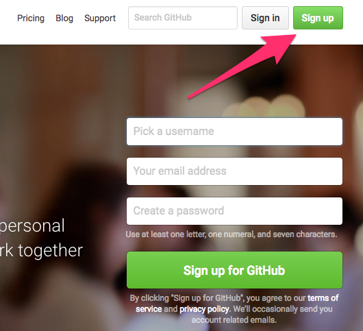

## Pick a Name and Password, Enter Gmail Address

First pick a name that is lower case. Trust us, it will be easier
for everyone later. You can always change your user name later, but
don't.  Pick something you will use for a long time. Your user name
will be included in your web site address, so you don't want it to
change.

Enter the [Gmail](gmail.md) address you should have already created.

Pick a [password that you will remember](passwd.md). 

**Never attempt more than one login**

GitHub has a quirk that if you forget your password and lock yourself
out trying to remember it you actually ***block everyone here from
logging in.*** This can destroy the flow of a class. It is so
important to remember this that if you happen to lock out a class
because you forgot, ***you will have to return to Prep for the rest of
the semester.*** We simply cannot afford to have careless students
harm everyone else.

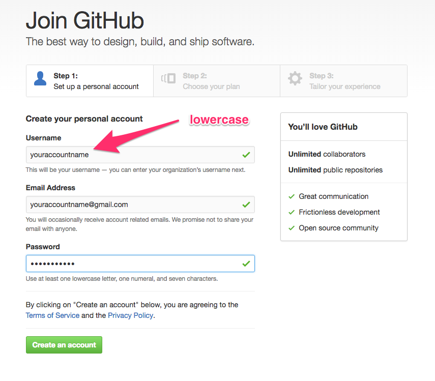

When you are sure everything looks good click on *Create an account.*

## Choose Public Plan

Public repos are free on GitHub. Private repos normally cost $7/month,
but for students and teachers are free if [you request it][request],
which you can do now or later.

[request]: https://education.github.com/discount_requests/new

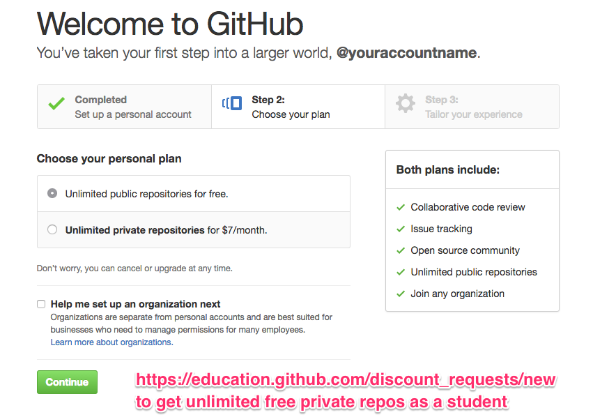

## Submit

You can take a moment to fill out the survey if you want. Otherwise,
just click *Submit*.

## Start a Project

Click *Start a project* to create your first project repo (short for
repository).

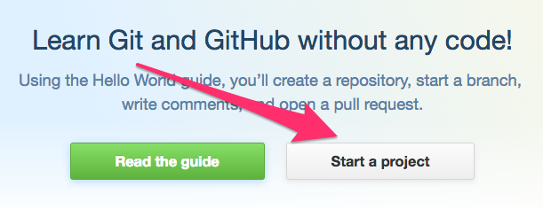

## What?! Denied. Go Verify Email.

Yeah, once upon a time you didn't have to verify your email. Now
you do.

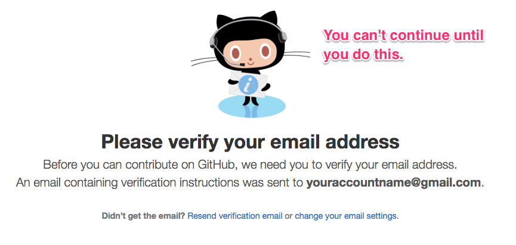
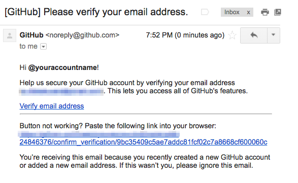

## Ok, NOW Create a Project Repo

Let's start with a special project repo, the one for your first web
site. Yep, GitHub has a thing called [GitHub
Pages](http://pages.github.com) that turns any repo into a web site.
But there is a special repo that is your main web site on GitHub
pages. 

It has to have a special name, the same name as will be the web site
address: `youraccount.github.io` (only replace `youraccount` with your
GitHub user name).

## Now We're Talkin', Er, Coding

This is what an empty repo looks like. Let's put something in it.
Click on the `README.md` link, which will open GitHub's editor.

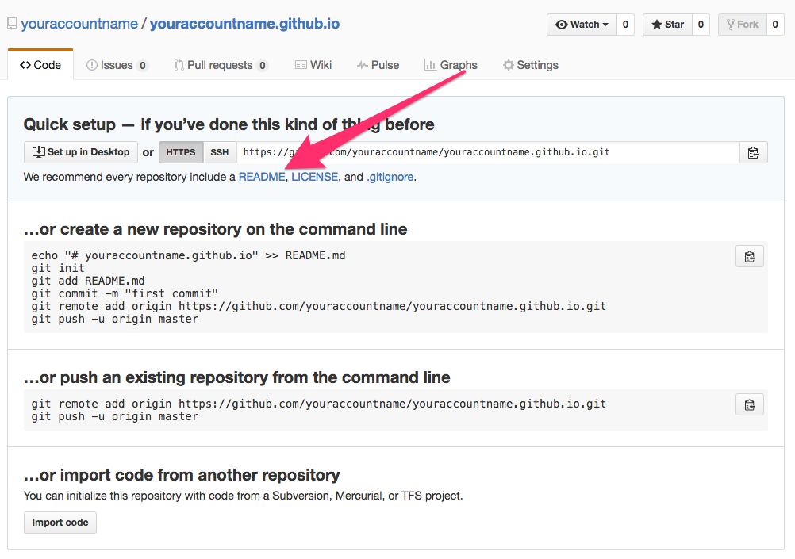

## Your First Web Page

Ok, so it won't be much, but it will give you a place to start working
on it as you learn stuff. 

1. Change the name `README.md` to `index.html`.

1. Enter something into the editor, doesn't matter what. Don't worry
   about HTML or now if you don't know any.

1. Now click the *Commit new file* button.

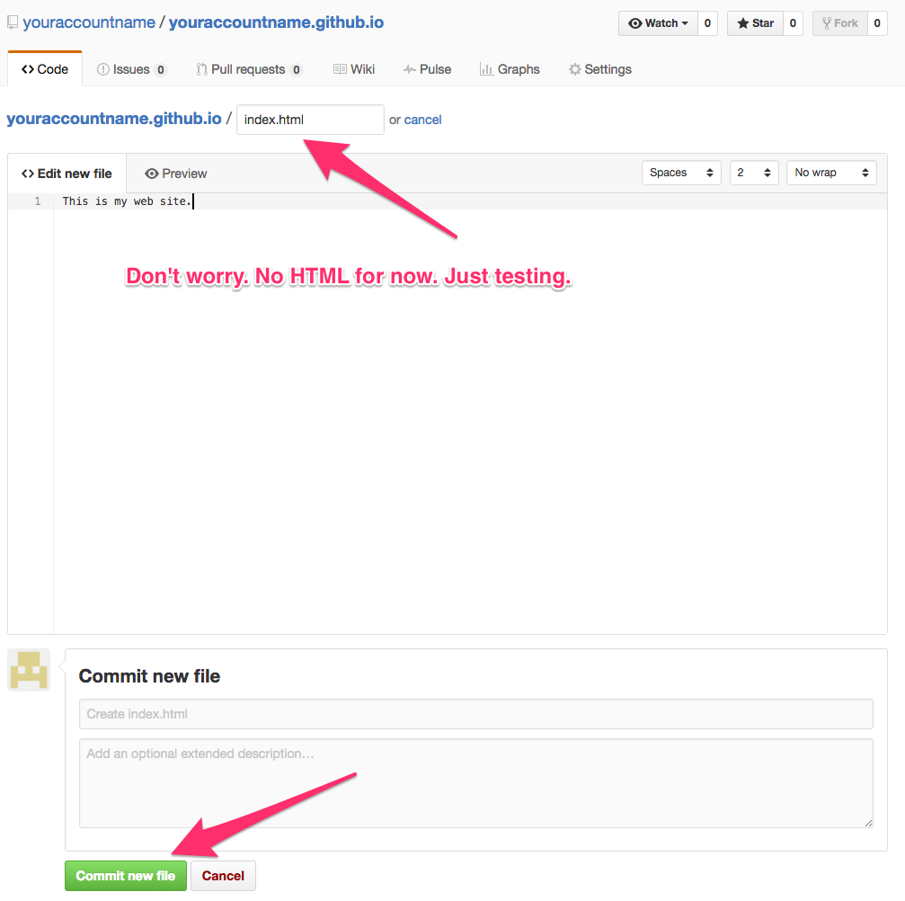

## Notice New File

You'll see a new `index.html` file in your repo now and can visit the
web site. In this case it would be `http://youraccountname.github.io`
but yours will be different.

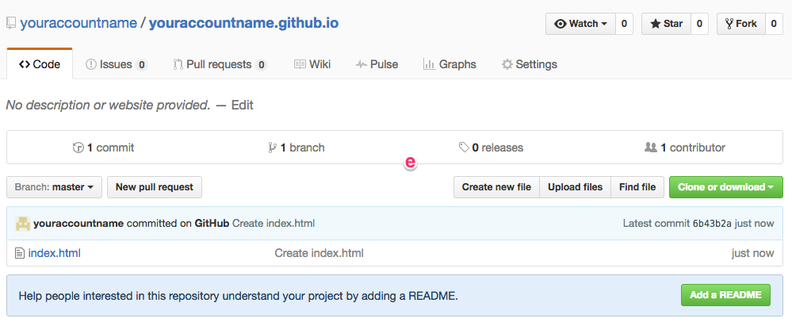

## Update Profile Avatar Image

Ok, so let's un-noobify your profile a little. Go file an image on the
interwebs and save it to your desktop. Then click on the profile icon.

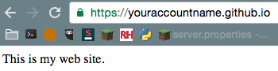

Now click on the profile image. Oh, and notice that you have a new
green dot for having made a commit, huzzzah!

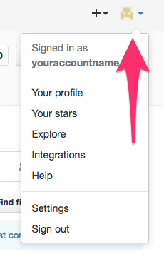

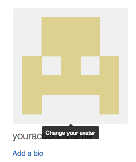

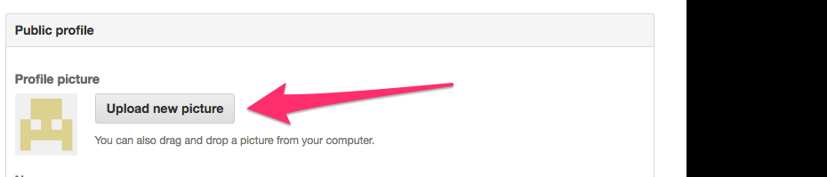

There, much better.

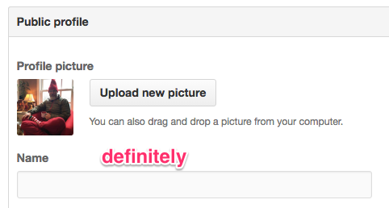

## Update the Rest, Or Not

The other rest of your profile is updated here as well. You really
don't need any of it for any course, but you may want to update it
eventually—especially as you begin to have more things in repos worth
finding and sharing.

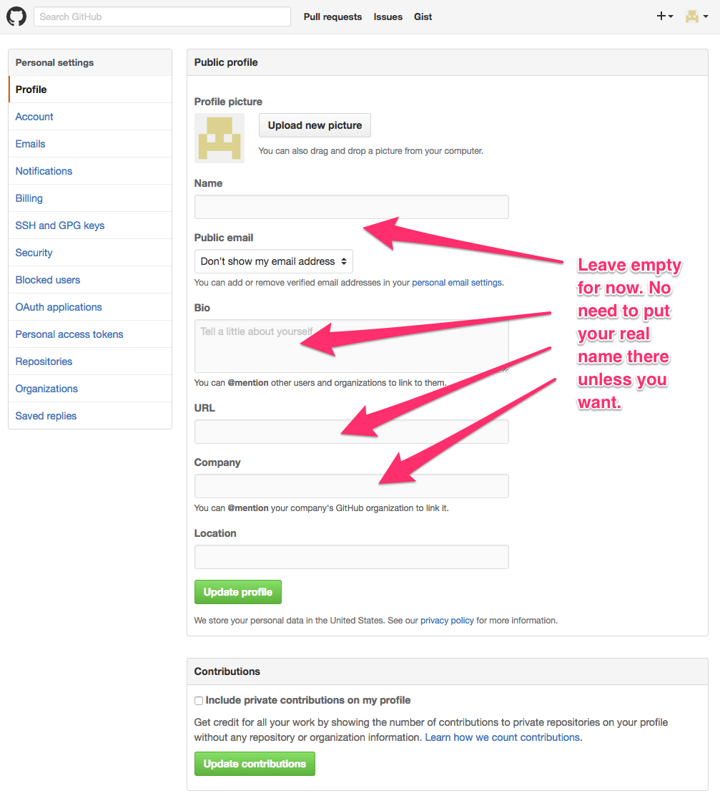

---
[][CC0]
[CC0]: https://creativecommons.org/share-your-work/public-domain/cc0/
