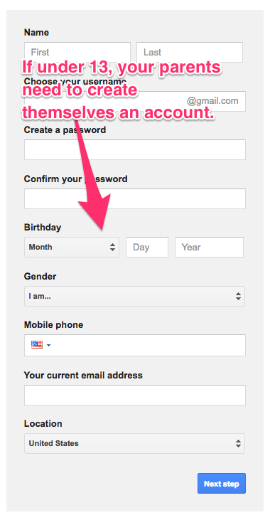
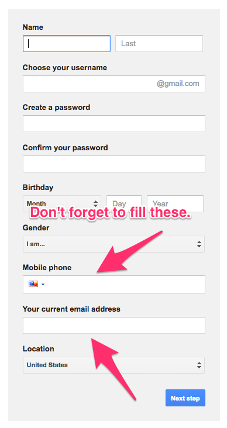

# Google Gmail Account

Having a Google account is an absolute essential today. There's no way
around it. Most web services and games have an option to login with
Google. There is also no email service that beats Gmail in its
ability to filter out spam, manage your inbox, and create multiple
accounts. ***You must have a Google Gmail account to be here,*** not
a Gmail account tied to a Yahoo or Hotmail address, but an *actual*
gmail account. Later, if you really want, you can forward your Gmail
to your other account (but we strongly recommend picking
a Gmail address to use for the rest of your technology life).

## 13 and Up

***If you are under 13 you are not legally allowed to have a Gmail
account.*** Your parents *are* allowed to have an account, however.
Your parents are the ones creating the account and they are the one
using it. This is important to accept and remember. If you are under
13 the Gmail account your parents create is theirs and they are
responsible for how it is used. If you ask really nicely they might
let you use it.

## Your Most Important Password

Gmail is the most important account and password information that you
remember. This is because you can forget the passwords and login
information to everything else and recover it rather simply by
providing your Gmail information that you used to create those
accounts.

When creating an account ***make sure you setup some sort of password
recovery option, preferrably a phone number.***

## Multiple Gmail Accounts

One of the main reasons Gmail makes the most sense is its support of
*multiple gmail account names*.

A lot of people don't know that when you create a Gmail account you
are actually creating an infinite number of different email addresses
that you can use for everything and anything, but that all direct
email sent to any of them to the same, single account. For example,
all of the following will go to the same `youraccount@gmail.com`
account:

* `youraccount@gmail.com`
* `your.account@gmail.com`
* `y.o.u.r.a.c.c.o.u.n.t@gmail.com`
* `youraccount+py@gmail.com`
* `youraccount+js@gmail.com`
* `youraccount+whatever@gmail.com`

This is extremely useful when you need more than one account on
another service, like CodeCombat, Twitter, GitHub or whatever else.

## Your Email Address

**My Gmail address is _____________.**

---
[][CC0]
[CC0]: https://creativecommons.org/share-your-work/public-domain/cc0/
