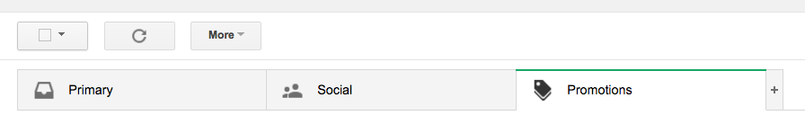
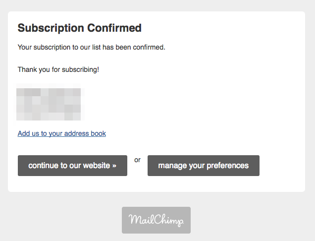
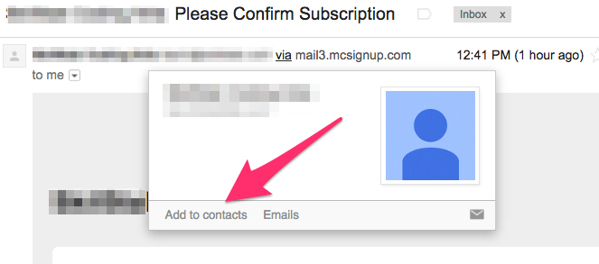

# Mailing List

The mailing list is one of the main ways to
[communicate](communications.md) with you are your parents about
changes, events and such. It is your responsibility to make sure
you and your parents know how to find these and read them. "Well I
didn't know," doesn't work.

## Checking Promotions Folder

Unfortunately the mail service that we use (mailchimp.com) is
automatically sent to the *Promotions* mail folder on Gmail. Here's
how to find it:

## Confirm Subscription

There will be an email in your main email folder that has something
like this in it. Click on *Accept*.

## Subscription Confirmed

## Add Contact So Comes to Main Folder

---
[][CC0]
[CC0]: https://creativecommons.org/share-your-work/public-domain/cc0/
