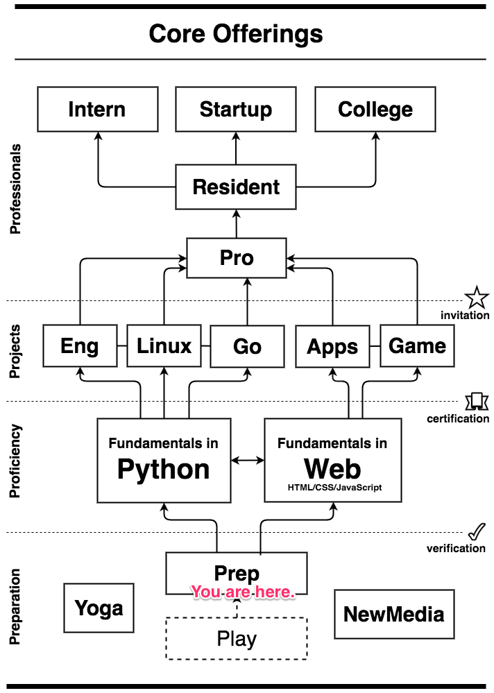

# Understanding Core Offerings

If we were a mall then *Core Offerings* we be our directional pillar.
You know those "you are here" things with a star helping you see
where you fit into the mall. So where is your star on our directional
pillar? At the very beginning.

## Preparation

As we have [discussed](../README.md) *Prep* is where it all begins,
(well, unless you were a *Play* camper before). *Prep*, *Play*,
[*Yoga*](http://github.com/skilstak/course-yoga), and
[*NewMedia*](http://github.com/skilstak/course-newmedia) are all
in the *Preparation* category. Stuff in this category is designed
to prepare—and help you maintain—your programming and other technical
skills as you build them. And, before you ask, yes yoga is technical
skill.

While *Yoga* and *NewMedia* are listed without connection to anything
they can be taken more than once, but are billed at the *Preparation*
tier.

## Proficiency

Proficiency means being able to show that you are able to do
something, that you are competent. The greater your level of
proficiency the closer you get to mastery. The two courses at this
level are designed to help you get proficient in coding, either in
[*Python*](http://github.com/skilstak/course-pyfun) or
[*Web*](http://github.com/skilstak/course-webfun) depending on which
[*technology path*](/path.md) you've chosen.

The Russians have a saying:

> Повторение – мать учения
> Repetition is the mother of learning

Some may achieve proficiency in a month, others a year, others
longer.  There are a lot of things that are involved in how quickly
someone learns something. ***The single biggest factor in learning
something is the amount of time practicing the activity.*** This
means those who spend time outside of class working on stuff will
advance faster. The smallest factor is aptitude and intelligence.
Remember this. If you find yourself advancing more slowly than
someone else it is very unlikely it is because you are "dumber"
than them. Instead you should look at how much time each day that
you are practicing and see if you can do more. It really is just
as simple as that. If you want to get good, you have to practice.
The sooner you learn that hard lesson the better.

You don't leave the *Proficiency* level until you *certify* that
you have gained proficiency in either [*Python*][pycert] or
[*Web*][webcert]. Think martial arts v.s. public school. You can't
earn a belt just because you changed grades. In fact, the more you
think about it, the more you will realize any organization that is
setup to advance students based on age and grade on a certain time
table is, well, flawed. Everyone is different.

[webcert]: http://github.com/skilstak/certification-web
[pycert]: http://github.com/skilstak/certification-python

## Projects

Montessori has championed the idea that projects foster independence,
accountability, internal drive, and ownership of one's own learning.
In that sense we agree a lot with the approach.  *Project* level
courses have a looser structure and emphasize mastery. Here's were
you take your proficiency to a place where you are using it all the
time. Classes sometimes have 15 minute lessons, and sometimes are
completely focused on student-selected projects from a group of
pre-made projects, or those of their own invention.

Currently there are only five *project*-level courses:

1. [Engineering](http://github.com/skilstak/engineering)
1. [Linux](http://github.com/skilstak/linux)
1. [Golang](http://github.com/skilstak/golang)
1. [Apps](http://github.com/skilstak/apps)
1. [Game](http://github.com/skilstak/game)

Project level courses can be taken over and over again allowing
different projects to make done in each. You need to have the
pre-requisites for a project-level course, however. For example, you
have to have certified in *Web* before you can take *Apps* and *Game*.

## Professionals

The professional level is for students who are seriously working
toward entering the higher education world (college) or working as
professionals either for themselves, for other clients, or for an
organization (including us).

Students must be recommended by their instructor and invited by the
location manager to be at the *Pro* level where [expectations are
different and higher][expectations] and where there are fewer spots
per course available.

Currently there is only one course at this level: *Pro*. 

We look forward to starting the *Resident*, *Intern*, *Startup*,
and *College* programs as we grow.

[expectations]: https://github.com/skilstak/course-pro/blob/master/whats-pro.md#expectations

---
[][cc-by-sa]
[][skilstak]
[cc-by-sa]: https://creativecommons.org/licenses/by-sa/4.0/
[skilstak]: http://skilstak.io
