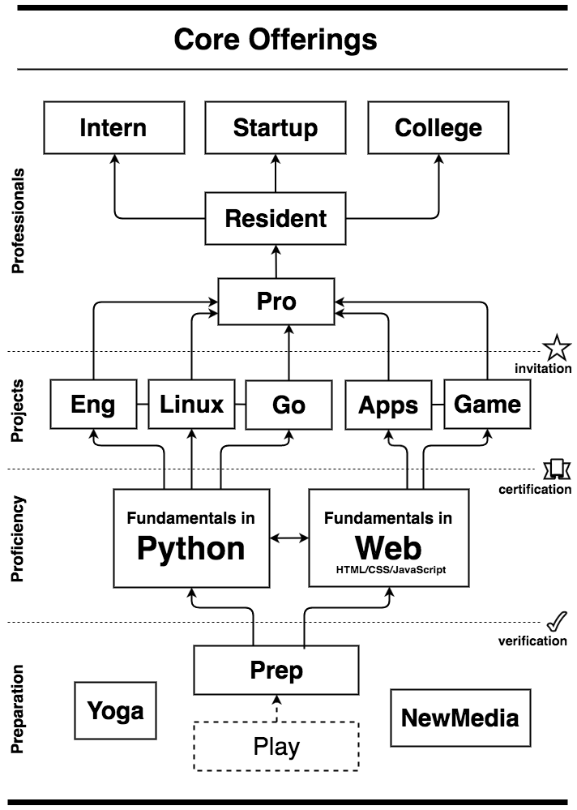

# Pick a Primary Technology Path

Although it might be one of the harder decisions you make, you
really need to pick a primary technology focus, a path early on
since other stuff builds on top of it. You can always change the
path later or do both paths, but for now pick either ***Web*** or
***Python***. You'll be able to bring it all together in Pro later
as well.

## Python

The *Python* path leads to *Engineering*, *Linux*, and *Go*
project-level courses.

Choose *Python* if you love the hacker-feel of nothing but
a powerful command-line running raw code. While Python is still used
extensively for graphic applications and even to serve web sites its
primary use today is for server administration, automation,
engineering, and number crunching. Python is also embedded in lots of
other applications like Photoshop, Blender and others.

The *Python* path takes less time because it is only one language,
not three.

## Web

The *Web* path leads to *Game* and *Apps* project-level courses.

Choose *Web* if you really enjoy anything graphic, or with moving
graphic parts. Web technology is mostly about front end
presentation, interfaces, and graphic interactivity.

*Web* technology is exploding as more moves the web browser.
Everything from simple web pages and games to complex applications
are being created using web technology today. Web technology can be
found on more devices than any other technology in history.
Web technology is actually three technologies used together:

* Hyper Text Markup Language (HTML)
* Cascading Style Sheets (CSS)
* JavaScript (JavaScript)

So, yeah, learning web technology takes longer but has a real wide
variety of uses. 

JavaScript is used in Unity for 3D game and simulation
development. Web technology can be used to make full desktop
applications like Slack or Atom with Electron. And, of course, web
tech is used for mobile apps more than ever now with technologies like
Phonegap and React native.

## Diagram

---
[][CC0]
[CC0]: https://creativecommons.org/share-your-work/public-domain/cc0/

