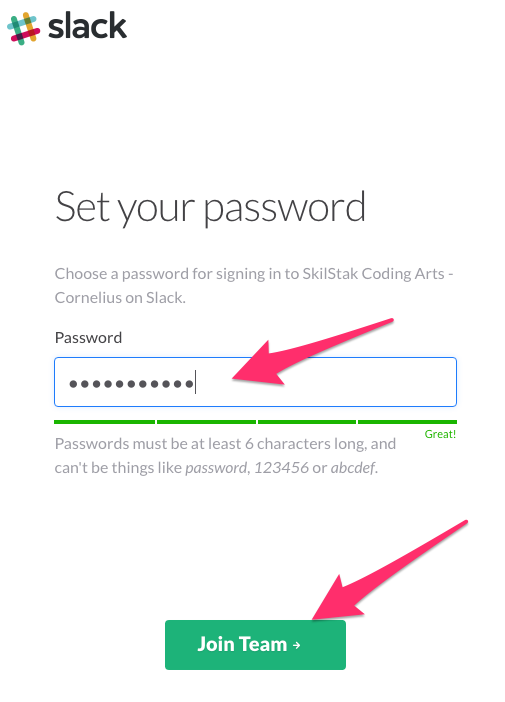
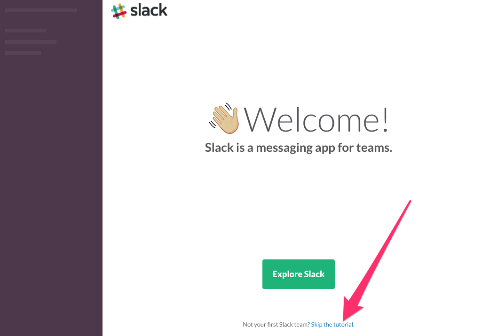
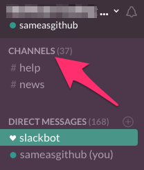
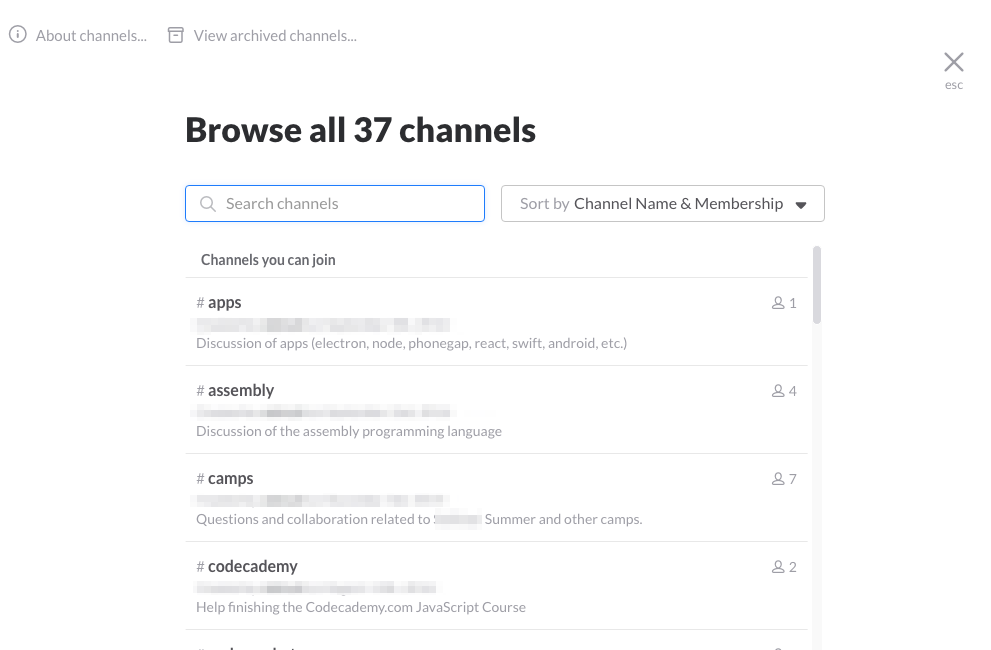
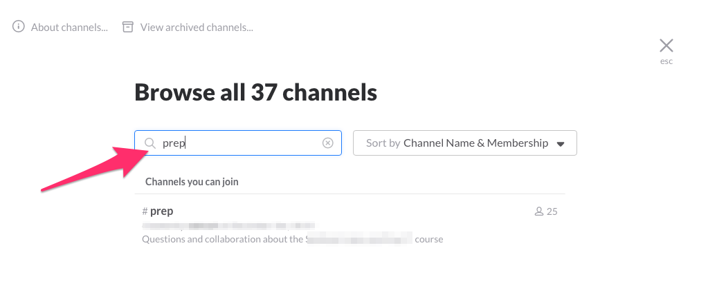
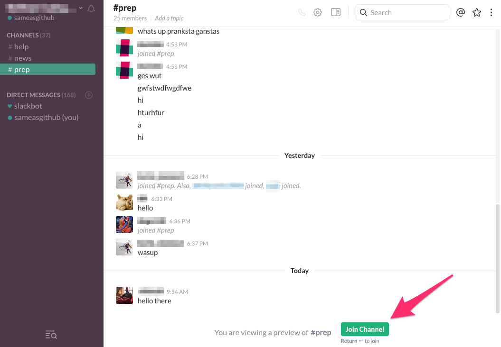

# Joining the Slack Chat Room

Slack is the main way we communicate in real time. Joining—and
using—Slack is the key to working with other students on projects,
getting help for whatever you are working on, and contacting
instructors, assistants, and staff directly.

Slack is the leading chat tool used by businesses, schools,
open source development teams, organizations, and about everything
else. It comes with a great mobile app that makes communication in
chat as easy as text messages. This is no *made-for-education* chat
tool, it's a *real* tool used by professionals, which is the main
reason we require learning it. 

## Get an Invite

Because we use a private repo (for obvious reasons) you'll need an
invite from your instructor, teacher assistant, or location manager.
Here's what it looks like in your in box:

## Join Your Team

## Set Your Password

## Skip the Tutorial

If you like you can skip the tutorial for now.

## Show All Channels

## Join the Prep Channel

---
[][CC0]
[CC0]: https://creativecommons.org/share-your-work/public-domain/cc0/
